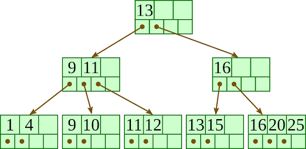

# GO B+ Trees

This repository contains a B+ tree implementation in our favourite language Golang.

### Why B+ Trees
B+ Trees are often used in database indexing and are widely used in most databases today. The B+ Tree provides garuntee of O(logn) complexity for the following operations: Search, insert, delete

Fig 1. Image of a B+ Tree commonly used in database indexing

### B+ Tree Coverage

This repository contains the following package structure:

- Blockmanager
  - Handles the creation of blocks
  - Insertion and deletion of records into blocks
  - Serialization / deserialization of data into byte arrays
- BpTree
  - Supports multiple duplicate keys using a linked list
  - Implements an dense, unclustered index
  - Supports basic operations like search , insert, delete, print tree
- Examples
  - source code examples of how to use the bp-tree
- TsvParser
  - Utility package to read in sample data

## Quick start
In order to ease the testing of the code, we provided 3 ways of running the source code:

1. Use go run and run the repo
2. Run the windows executable
3. Using docker container

### Go run

This package requires [golang](https://golang.org/) to run. After installing golang, we need to run the following commands:

This install the local Go project and run the experiments. From the root directory run
~~~
go run ./examples/experiment/main.go
~~~

After which we can check the logs at `/logs`

### Windows executable

We have also provided a windows executable. Just double click the exectuable to run it

### Docker build

We also provide a docker build to test run the experiments. To use the docker build, we need to have [docker](https://www.docker.com/products/docker-desktop) installed.

From the root directory run:
~~~
docker build -t golang-bptree .
docker run -v <your-path-to-logs-folder>:/app/logs/ golang-bptree 

e.g.
docker run -v /Users/anthonyfongkuoxin/Desktop/SCSE/CZ4031/logs:/app/logs/ golang-bptree 
~~~

